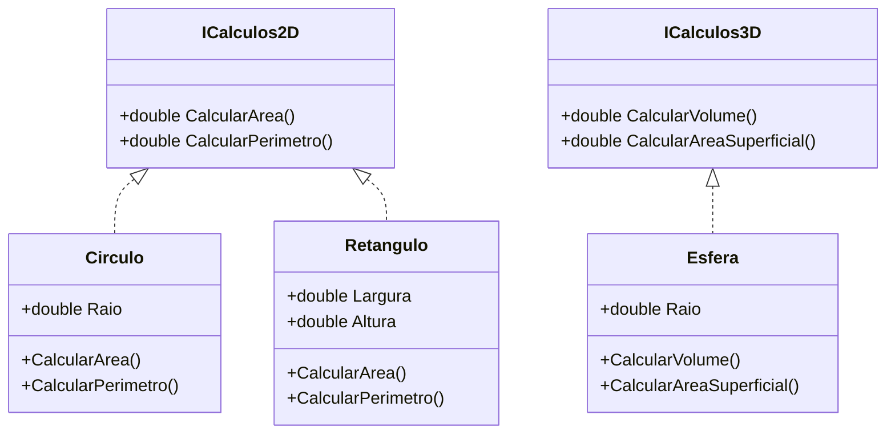
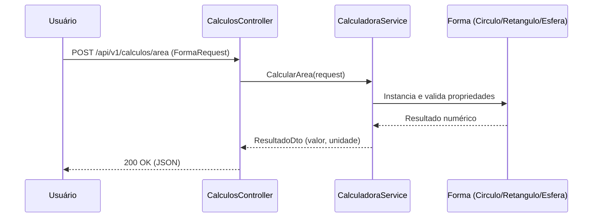

# GeoMaster API • Cálculos Geométricos 2D/3D


> **Contexto CP4** — O objetivo é desenvolver uma API RESTful para cálculos geométricos (2D e 3D), com foco em arquitetura limpa, extensível e bem documentada, usando .NET 8+ e Swagger.

---

## Índice

1. [Visão Geral](#visão-geral)  
2. [Arquitetura & Padrões](#arquitetura--padrões)  
   2.1 [Diagrama de Componentes](#diagrama-de-componentes)  
   2.2 [Diagrama de Classes (Formas)](#diagrama-de-classes-formas)  
   2.3 [Fluxo de Requisição](#fluxo-de-requisição)  
3. [Estrutura do Projeto](#estrutura-do-projeto)  
4. [Modelagem do Domínio](#modelagem-do-domínio)  
5. [Endpoints & Exemplos](#endpoints--exemplos)  
6. [Validação & Erros](#validação--erros)  
7. [Execução Local](#execução-local)  
8. [Documentação (Swagger / Scalar)](#documentação-swagger--scalar)  
9. [Como Estender (OCP)](#como-estender-ocp)  
10. [Aderência ao CP4 (Checklist)](#aderência-ao-cp4-checklist)  
11. [Roadmap](#roadmap)  
12. [Autores](#autores)

---

## Visão Geral

A **GeoMaster API** expõe operações de cálculo para **formas 2D** (ex.: círculo, retângulo) e **formas 3D** (ex.: esfera). A API segue princípios **SOLID** e **Clean Code**, com **Swagger/OpenAPI** para documentação.

**Versão do projeto**: o `csproj` está em **.NET 9.0** (`<TargetFramework>net9.0</TargetFramework>`), atendendo ao requisito “.NET 8 (ou superior)”.  
**Dependências**: `Swashbuckle.AspNetCore` (Swagger) e `Scalar.AspNetCore` (referência de API moderna). *(Scalar está referenciado no csproj, mas não configurado em `Program.cs` por padrão.)*

---

## Arquitetura & Padrões

A divisão respeita **ISP** (interfaces separadas por dimensionalidade) e **SRP** (cada forma calcula apenas o que lhe cabe). O **serviço de orquestração** concentra a lógica de “qual cálculo para qual forma” (*DIP*: é injetado no controller). As tarefas do CP4 pedem esse recorte e evitam `switch/if` tipo-driven para aderir ao **OCP**.

### Diagrama de Componentes

```mermaid
graph TD
    Client[Cliente / Frontend] -->|HTTP JSON| Ctrl[CalculosController]
    Ctrl --> Svc[CalculadoraService (DIP)]
    Svc --> M2D[Formas 2D: Circulo, Retangulo]
    Svc --> M3D[Formas 3D: Esfera]
    Svc --> DTO[DTOs: FormaRequest, ResultadoDto, FormasDuplasRequest]
    subgraph Infra
      Swagger[Swagger/OpenAPI]:::doc
      DI[ASP.NET Core DI]:::infra
    end
    Ctrl -. Docs .-> Swagger
    classDef doc fill:#eaffea,stroke:#2ecc71,color:#2e7d32
    classDef infra fill:#eef,stroke:#88f,color:#224
```

### Diagrama de Classes (Formas)



### Fluxo de Requisição



---

## Estrutura do Projeto

```
GeoMasterAPI/
├── Controllers/
│   └── CalculosController.cs
├── DTOs/
│   ├── FormaRequest.cs
│   ├── ResultadoDto.cs
│   └── FormasDuplasRequest.cs
├── Models/
│   ├── ICalculos2D.cs
│   ├── ICalculos3D.cs
│   ├── Circulo.cs
│   ├── Retangulo.cs
│   └── Esfera.cs
├── Services/
│   ├── ICalculadoraService.cs
│   └── CalculadoraService.cs
├── Program.cs
└── GeoMasterAPI.csproj
```

---

## Modelagem do Domínio

- **DTOs**
  - `FormaRequest`: `{ "tipoForma": "circulo" | "retangulo" | "esfera", "propriedades": { ... } }`
  - `FormasDuplasRequest`: `{ "externa": FormaRequest, "interna": FormaRequest }`
  - `ResultadoDto`: `{ valor: number, unidade: "u" | "u²" | "u³" }`

- **Formas & Regras**
  - **Circulo** (`ICalculos2D`): `Raio > 0`, área `πr²`, perímetro `2πr`.
  - **Retangulo** (`ICalculos2D`): `Largura, Altura > 0`, área `L×A`, perímetro `2(L + A)`.
  - **Esfera** (`ICalculos3D`): `Raio > 0`, volume `4/3 πr³`, área superficial `4πr²`.

---

## Endpoints & Exemplos

### 1) Área — `POST /api/v1/calculos/area`

**Request (círculo)**  
```json
{ "tipoForma": "circulo", "propriedades": { "raio": 10 } }
```

**Response**  
```json
{ "valor": 314.1592653589793, "unidade": "u²" }
```

### 2) Perímetro — `POST /api/v1/calculos/perimetro`

**Request (retângulo)**  
```json
{ "tipoForma": "retangulo", "propriedades": { "largura": 5, "altura": 3 } }
```

**Response**  
```json
{ "valor": 16, "unidade": "u" }
```

### 3) Volume — `POST /api/v1/calculos/volume`

**Request (esfera)**  
```json
{ "tipoForma": "esfera", "propriedades": { "raio": 2.5 } }
```

**Response**  
```json
{ "valor": 65.44984694978736, "unidade": "u³" }
```

### 4) Área Superficial — `POST /api/v1/calculos/superficie`

**Request (esfera)**  
```json
{ "tipoForma": "esfera", "propriedades": { "raio": 2.5 } }
```

**Response**  
```json
{ "valor": 78.53981633974483, "unidade": "u²" }
```

### 5) Forma Contida — `POST /api/v1/calculos/validacoes/forma-contida`

**Request (círculo dentro de retângulo)**  
```json
{
  "externa": { "tipoForma": "retangulo", "propriedades": { "largura": 10, "altura": 8 } },
  "interna": { "tipoForma": "circulo", "propriedades": { "raio": 4 } }
}
```

**Response**  
```json
true
```

---

## Validação & Erros

- **Regras**  
  - Dimensões **não podem ser negativas** (usar `DataAnnotations` como `[Range(0.01, double.MaxValue)]` nos DTOs/modelos).  
  - Em **entrada inválida**, retornar **400 Bad Request** com mensagem clara.  
  - Se o cálculo solicitado **não se aplica** à forma (ex.: volume de um círculo), retornar erro apropriado.  

- **Formato de Erro (exemplo)**  
  ```json
  {
    "type": "about:blank",
    "title": "Entrada inválida",
    "status": 400,
    "detail": "Mensagem explicando o problema…"
  }
  ```

---

## Execução Local

```bash
# 1) Restaurar dependências
dotnet restore

# 2) Rodar a API (perfil Development com Swagger UI)
dotnet run

# URLs padrão (launchSettings.json)
# http://localhost:5031    | https://localhost:7230
```

---

## Documentação (Swagger / Scalar)

- **Swagger UI**: habilitado em **Desenvolvimento** (ver `Program.cs`).
- **Scalar.AspNetCore**: presente no `csproj`; opcionalmente, configure para uma UI de documentação moderna.

**Sugestões rápidas** (opcional, para 100% do critério de documentação):
1. Ativar arquivo XML no `csproj`.
2. Comentar controllers/métodos com `/// <summary>…</summary>` e usar `[ProducesResponseType]`.

---

## Como Estender (OCP)

**Situação atual**: o serviço usa um `switch` sobre `tipoForma` para instanciar as formas a partir de `FormaRequest` (funciona, porém é menos aderente ao **OCP**).

**Estratégia recomendada**:
- Definir uma **fábrica/registry** `IFormaFactory` com mapeamento **tipo → handler** (ex.: `circulo → CirculoHandler`), registrada via DI.
- Cada **handler** conhece suas **propriedades** (raio, largura/altura, etc.) e valida/instancia a forma 2D/3D.
- A `CalculadoraService` apenas **resolve** o handler pelo `tipoForma` e invoca a operação apropriada (**sem switch/if**).
- Para serialização polimórfica, considerar um **`JsonConverter`** customizado para `FormaRequest` caso queira aceitar payloads mais ricos.

**Adicionar nova forma (ex.: Triângulo/Cubo)**:
1. Criar classe (`Triangulo` implementando `ICalculos2D`, por ex.).
2. Criar `TrianguloHandler` e registrá-lo no DI.
3. (Opcional) Atualizar converter/mapeamento para aceitar `tipoForma: "triangulo"`.

---

## Aderência ao CP4 (Checklist)

- **Tecnologias**: .NET 8+ (projeto em .NET 9), ASP.NET Core Web API, Swagger. ✅  
- **Domínio (SRP/ISP/OCP)**: interfaces 2D/3D e classes pedidas; fórmulas corretas. ✅  
- **Serviço (DIP)**: `ICalculadoraService` injetado no controller. ✅  
- **Endpoints**: `/area`, `/perimetro`, `/volume`, etc., e **forma-contida**. ✅  
- **Model Binding/DTOs**: `FormaRequest`/`FormasDuplasRequest` aceitam formas diferentes. ✅  
  - *Sugestão do CP4*: `JsonConverter` polimórfico para enriquecer desserialização. 🔶  
- **Validação & Erros**: DataAnnotations; 400 para entradas inválidas; erro para cálculo inadequado. ✅  
- **Swagger**: habilitado; **recomenda-se** XML Docs + `[ProducesResponseType]` para pontuar máximo. 🔶  
- **Desafio Final**: endpoint **forma-contida** com lógica geométrica (incl. diagonal do retângulo). ✅  

Legenda: ✅ pronto | 🔶 recomendado/ajuste fino

---

## Roadmap

- [ ] Remover `switch` em `CalculadoraService` e adotar **Strategy/Factory** (pleno OCP).  
- [ ] Habilitar **XML docs** no `csproj` e anotações de resposta nos controllers.  
- [ ] Configurar **Scalar.AspNetCore** (UI moderna) além do Swagger UI.  
- [ ] Criar **tests** (xUnit) para fórmulas e para o algoritmo de **forma-contida**.  
- [ ] Adicionar novas formas (ex.: **Triângulo**, **Cubo**) como prova de extensibilidade.

---

## Autores


- Amanda Mesquita — RM559177  
- Journey Tiago — RM556071  
- Paulo André Carminati — RM557881
